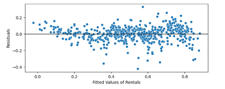

# Linear Regression
> This case study aims to demonstrate the application of linear regression in a real-world business scenario for the bike-sharing provider "BoomBikes". The goal is to make a model for shared bikes using available independent variables. Management will use this model to understand how various features influence demand. This insight will allow them to adjust their business strategy to meet demand levels and satisfy customer expectations. Additionally, the model will help management comprehend the demand dynamics when entering a new market.

## Table of Contents
* [Data Exploration and Cleaning](#data-exploration-and-cleaning)
* [EDA and Data Visualization](#eda-and-data-visualization)
* [Data Preparation](#data-preparation)
* [Model Building](#model-building)
* [Making Predictions Using the Final Model](#making-predictions-using-the-final-model)
* [Detailed Coefficients](#detailed-coefficients)
* [Conclusion](#conclusion)
* [Technologies Used](#technologies-used)
* [Contact](#contact)
* [License](#license)

<!-- You can include any other section that is pertinent to your problem -->

## Data Exploration and Cleaning
- In the given dataset, several columns were identified as not contributing towards the business goal of modeling bike demand. Such columns were instant, dteday, casual and registered. We have dropped these columns.
- Some columns in the dataset were initially represented in numerical form but hold categorical meanings. These columns were converted to their respective categorical forms based on the data dictionary to enhance data representation and understanding
- Assumed that the numerical values 0 to 6 represent the days of the week from Sunday to Saturday. This assumption aligns with common data representation practices and helps in interpreting day-specific patterns in bike demand

<!-- You don't have to answer all the questions - just the ones relevant to your project. -->

## EDA and Data Visualization

### Univariate Analysis - Visualising Numerical Variables

- Strong Positive Correlation between `temp` and `atemp`, removing atemp.
- Strong Positive Correlation between `temp` and `cnt`. 
- There is no strong multicollinearity observed among the other numerical columns.
- Most of the days have temperature 10-30 degrees.
- Distribution of temp and atemp are almost similar.
- Most of the days are with humidity 50-80.
- Wind speed seems to be distributed mostly between 5 - 20.
- Total count of rental bikes seems to be normally distributed with a mean value between 4000-5000.

### Univariate Analysis - Categorical

- Season

  - Higher median bike rentals during summer and fall compared to spring and winter.
  - Winter has the lowest median bike rentals, indicating seasonality affects bike rentals significantly.
    
Observation:
Seasonality should be considered in the model as it has a significant impact on bike rentals.

- Weather Situation (weathersit)

  - Clear weather conditions have the highest median bike rentals.
  - Adverse weather conditions like Heavy Rain/Snow have significantly lower bike rentals.
    
Observation:
Weather conditions are important predictors for bike rentals and should be included in the model.

- Month (mnth)

  - There are noticeable variations in bike rentals across different months.
  - Peak rentals observed during warmer months (May, June, July, etc.).
    
Observation:
Monthly variations suggest that month can be a useful predictor for the model, capturing seasonal trends.

- Year (yr)

  - An increasing trend in bike rentals from 2018 to 2019, indicating growing popularity.
    
Observation:
Including the year in the model can help capture the trend of increasing bike rentals over time.

- Holiday

  - Non-holidays have higher median bike rentals compared to holidays.
    
Observation:
Day type (holiday or not) can affect bike rentals and should be considered in the model

- Weekday

  - Variations in bike rentals across different days of the week.
  - Slightly higher rentals on weekdays compared to weekends.
    
Observation:
Overall, no significant difference in rentals across weekdays is observed.

- Working Day

  - Higher median bike rentals on working days compared to non-working days.
    
Observation:
Working days can affect bike rentals, making it a relevant feature for the model.

### Bivariate Analysis - Categorical

- Season - Weather

  - Most of the days in Fall season were good with clear sky followed by Summer, Spring and Winter.
  - Winter has most number of bad weather days.

- Month - Weather

  - Most of the days in the month of June, July, August and November are good weather days.
  - October has the most number of bad weather days with heavy shower/snow.

- Season - Rental Count

  - Rental count was the highest in the Fall season irrespective of the weather condition.
  - Spring season has the lowest demand.

- Month - Rental Count with Weather

  - In most months if the weather is good/fair, demand is higher.
  - In July, irrespective of the weather conditions, demand is high.
  - The demand is the lowest in January.

- Holiday - Rental Count

  - Looks like holidays have less demand.

## Data Preparation

- Creating Dummy variables for the categorical columns - 'season', 'weathersit', 'mnth', 'weekday', 'holiday', 'workingday', 'yr'.
- Splitting data into Train and Test in 70-30 proportion.
- Rescaling the features of the training data using Min-Max Scaler.

## Model Building

### Assumptions
- Before building the model, let's put the assumptions of a linear regression model -

  - There is a linear relationship between X and y
  - Error terms are normally distributed with a mean value 0
  - Error terms have constant variance ( homoscedasticity )
  - Error terms are independent of each other ( no multicollinearity )
  - Also we are going to assume 95% confidence interval. So, we will take into consideration p-value below 5% or p-value < 0.05. Similarly we will assume VIF limit of 5.

- Splitting training data into X and y

- Simple Linear Regression with `temp` 
	- very low R-squared value
- Multiple linear regression model using all variables
	- Some variables have very high VIF values and high p-values, so it is better to use Recursive Feature Elimination (RFE) to determine the best variables.
- Using RFE
	- The columns we get from RFE will be considered for further manual refining of the model.

## Residual Analysis of the train data 

### Interpretation
1. The errors are centered around zero, which is a good sign. This indicates that the model does not have a consistent bias in one direction.
2. The density curve resembles a normal distribution (bell curve), which is also a positive indicator. Normally distributed errors suggest that the model captures the data patterns well and that the errors are random.
3. The spread of the errors (width of the distribution) indicates the model's accuracy. A narrower spread would indicate more precise predictions, whereas a wider spread indicates more variation in the error terms.

### Assessment
- **Good Model Indicators**: 
  - Errors centered around zero.
  - Symmetrical, bell-shaped distribution of errors.
  - Minimal skewness (no long tails in one direction).

Based on the visualization, it seems like the model is performing well, with errors centered around zero and following a roughly normal distribution.

## Making Predictions Using the Final Model

- Residual Analysis on Training data

  
  - The errors are centered around zero, which is a good sign. This indicates that the model does not have a consistent bias in one direction.
  - The density curve resembles a normal distribution (bell curve), which is also a positive indicator. Normally distributed errors suggest that the model captures the data patterns well and that the errors are random.
  - The spread of the errors (width of the distribution) indicates the model's accuracy. A narrower spread would indicate more precise predictions, whereas a wider spread indicates more variation in the error terms.

- Scatter plot between the fitted values of 'rentals' and the residuals

  - Overall, this residuals vs. fitted values plot suggests that the regression model is performing well and that the assumptions underlying the model are being met. The model appears to be reliable, as indicated by the random scatter of residuals around the horizontal line at zero.

- r2_score(y_true=y_test, y_pred = y_test_pred) = 0.81

- Plotting y_test and y_pred to understand the spread
	- Overall, this `y_test` vs `y_pred` plot suggests that the regression model is performing well and making accurate predictions. The model appears to be reliable, as indicated by the closeness of the points to the 45-degree line and the lack of systematic bias in the predictions.

- Actual vs Predicted

  - Overall, this actual vs. predicted plot suggests that the regression model is performing well and making accurate predictions. The model appears to be reliable, as indicated by the closeness of the points to the 45-degree line and the lack of systematic bias in the predictions.

- Calculate residuals - (residuals = y_test - y_test_pred)

	- Overall, this histogram suggests that the model is well-fitted to the data, as the residuals are normally distributed and centered around zero, with only a few outliers. This is a good indication of a reliable regression model.

Overall, the model appears to be reliable and well-fitted to the data, as indicated by the actual vs. predicted plot.

### Explanation of Errors

1. **Mean Squared Error (MSE)**:
   - **Value**: In this case, the MSE is 0.0089.
   - **Interpretation**: A lower MSE indicates a better fit of the model. However, it is sensitive to outliers since it squares the errors.

2. **Mean Absolute Error (MAE)**:
   - **Value**: In this case, the MAE is 0.0714.
   - **Interpretation**: MAE is a measure of errors in the same units as the target variable and is less sensitive to outliers compared to MSE.

4. **Root Mean Squared Error (RMSE)**:
   - **Value**: In this case, the RMSE is 0.0947.
   - **Interpretation**: RMSE gives an idea of the magnitude of error and is in the same units as the target variable. Lower RMSE indicates better fit and is useful for understanding the magnitude of prediction errors.

## Detailed Coefficients
- **const**: `0.2144` - The intercept of the regression equation.
- **temp**: `0.4474` - For each unit increase in temperature, the dependent variable increases by 0.4474 units, holding other variables constant.
- **windspeed**: `-0.1517` - For each unit increase in windspeed, the dependent variable decreases by 0.1517 units, holding other variables constant.
- **season_spring**: `-0.0828` - Being in the spring season decreases the dependent variable by 0.0828 units compared to the reference season, holding other variables constant.
- **season_winter**: `0.0866` - Being in the winter season increases the dependent variable by 0.0866 units compared to the reference season, holding other variables constant.
- **weathersit_Light Snow/Rain**: `-0.2870` - Light snow or rain decreases the dependent variable by 0.2870 units compared to clear weather, holding other variables constant.
- **weathersit_Mist/Cloudy**: `-0.0793` - Mist or cloudy weather decreases the dependent variable by 0.0793 units compared to clear weather, holding other variables constant.
- **mnth_March**: `0.0542` - Being in March increases the dependent variable by 0.0542 units compared to other months, holding other variables constant.
- **mnth_April**: `0.0534` - Being in April increases the dependent variable by 0.0534 units compared to other months, holding other variables constant.
- **mnth_May**: `0.0643` - Being in May increases the dependent variable by 0.0643 units compared to other months, holding other variables constant.
- **mnth_Jun**: `0.0362` - Being in June increases the dependent variable by 0.0362 units compared to other months, holding other variables constant.
- **mnth_Sept**: `0.0911` - Being in September increases the dependent variable by 0.0911 units compared to other months, holding other variables constant.
- **holiday_Yes**: `-0.0910` - Being a holiday decreases the dependent variable by 0.0910 units, holding other variables constant.
- **yr_2019**: `0.2346` - Being in the year 2019 increases the dependent variable by 0.2346 units compared to other years, holding other variables constant.

#### We can write the regression equation Based on the coefficients provided in the OLS regression results. The general form of a regression equation is:
    
    cnt = X0 + X1 * temp + X2 * windspeed + X3 * season_spring + ... + X13 * yr_2019

    Using the coefficients from the OLS results:

    - X0 = 0.2144 (constant term)
    - X1 = 0.4474 (temp)
    - X2 = -0.1517 (windspeed)
    - X3 = -0.0828 (season_spring)
    - X4 = 0.0866 (season_winter)
    - X5 = -0.2870 (weathersit_Light Snow/Rain)
    - X6 = -0.0793 (weathersit_Mist/Cloudy)
    - X7 = 0.0542 (mnth_March)
    - X8 = 0.0534 (mnth_April)
    - X9 = 0.0643 (mnth_May)
    - X10 = 0.0362 (mnth_Jun)
    - X11 = 0.0911 (mnth_Sept)
    - X12 = -0.0910 (holiday_Yes)
    - X13 = 0.2346 (yr_2019)

    The regression equation can be written as:

    cnt = 0.2144 + 0.4474 * temp - 0.1517 * windspeed - 0.0828 * season_spring + 0.0866 * season_winter 
    - 0.2870 * weathersit_Light Snow/Rain - 0.0793 * weathersit_Mist/Cloudy + 0.0542 * mnth_March 
    + 0.0534 * mnth_April + 0.0643 * mnth_May + 0.0362 * mnth_Jun + 0.0911 * mnth_Sept 
    - 0.0910 * holiday_Yes + 0.2346 * yr_2019

    This equation predicts the cnt variable (the dependent variable) based on the given independent variables and their corresponding coefficients 

## Conclusion

### Feature with the highest impact on the rental bike count is:

- Temperature (temp): The coefficient for temperature is 0.4474, which means that for each unit increase in temperature, the rental bike count increases by 0.4474 units, holding all other variables constant. This indicates that temperature has the most substantial positive impact on the rental bike count among the features included in the model.
- Year (yr_2019): The coefficient for the year 2019 is 0.2346, which means that being in the year 2019 increases the rental bike count by 0.2346 units compared to other years, holding all other variables constant. This indicates a significant increase in the rental bike count in 2019.
- Weather Situation (weathersit):

    - Light Snow/Rain: The coefficient is -0.2870, indicating that light snow or rain decreases the rental bike count by 0.2870 units compared to clear weather, holding all other variables constant.
    - Mist/Cloudy: The coefficient is -0.0793, indicating that mist or cloudy weather decreases the rental bike count by 0.0793 units compared to clear weather, holding all other variables constant.
- Month:
    - March, April, May, June, September: All these months have positive impacts on the rental bike count, with September having the highest positive impact among the months listed.

- Note: Full name of some varibale, as we have shorted due to long name
  - Short name and their full name of wethersiuation
    - Clear = Light Snow, Light Rain + Thunderstorm + Scattered clouds, Light Rain + Scattered clouds
    - Mist/Cloudy = Mist + Cloudy, Mist + Broken clouds, Mist + Few clouds, Mist
    - Light Snow/Rain = Light Snow, Light Rain + Thunderstorm + Scattered clouds, Light Rain + Scattered clouds
    - Heavy Rain/Snow = Heavy Rain + Ice Pallets + Thunderstorm + Mist, Snow + Fog

## Technologies Used

- Python - v3.11.5
- Pandas - v2.2.1
- NumPy - v1.26.4
- Seaborn - v0.12.2
- MatplotLib - v3.7.2
- sklearn - 1.3.0
- statsmodels - 0.14.0

## Acknowledgements

This project was inspired by the UpGrad IITB Programme as a case study for the Machine Learning and Artificial Intelligence course.

## Contact

Created by [@manishkprj](https://github.com/manishkprj) - feel free to contact me!

## License

This project is open source and available without restrictions.

<!-- Optional -->
<!-- ## License -->
<!-- This project is open source and available under the [... License](). -->

<!-- You don't have to include all sections - just the one's relevant to your project -->